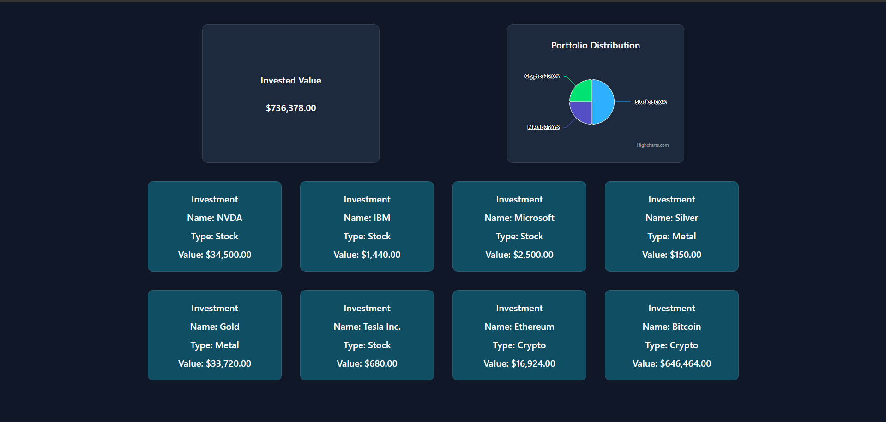

# Prerequisites

- Install the dotnet 9 SDK from here https://dotnet.microsoft.com/en-us/download

- Install Node version 22.18.0 - either use `nvm` (https://github.com/nvm-sh/nvm) or download node from here - https://nodejs.org/en/download (click on "Windows Installer (.msi)")

Please do be aware ports 5000, 5001 and 3000 should be available, no other processes should listening on those.
Checking ports used and killing processes: https://sentry.io/answers/kill-process-using-port-in-windows/

# Database

An installation of the SQL Server relational database management system is required. Version 2022 is recommended.

# Database Migrations

Install the EF Core CLI tool:
https://learn.microsoft.com/en-us/ef/core/cli/dotnet

While in the projects root folder, in a terminal:

- To apply the migrations run: `dotnet ef database update --verbose --project PT.Data`

# Setup / Build

Run those commands:

- In `<ProjectRoot>/PT.API/`: `dotnet run --urls "http://localhost:5000;https://localhost:5001"`
- In `<ProjectRoot>/PT.UI/`: `npm install`, then `npm run dev`

Access the API documentation at `http://localhost:<app_port>/swagger/index.html` where `<app_port>` is the https port printed in the console (i. e. https://localhost:5001/swagger/index.html).

Access the UI at `http://localhost:3000`

# Gallery

The app should look like in the screenshot:

